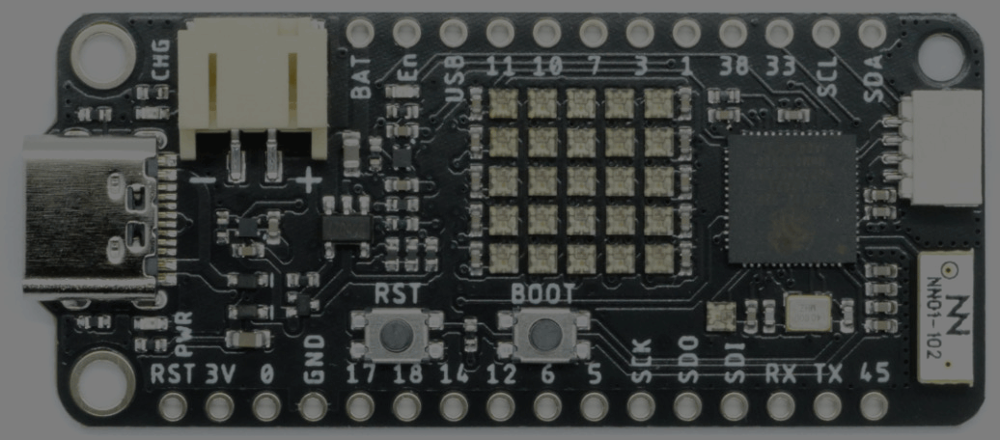

# CircuitPython FeatherS2 Neo RGB Matrix

Porting the [TinyPICO 5x14 LOL RGB Shield library](https://github.com/mcauser/circuitpython-tinys2-lol-rgb-shield) to the [FeatherS2 Neo](https://unexpectedmaker.com/feathers2-neo) 5x5 matrix

5x5 RGB Matrix power pin IO4, data pin IO21.

## Demo



```python
from matrix import *
display = MATRIX()

display.write('It Works!', RAINBOW)
display.power(False)
```

## Examples

```python
from matrix import *
display = MATRIX()

# persist settings so you dont need to add them to each write() call
display.set_color(RED)
display.set_delay(SHORT_PAUSE)
display.set_boundary(CHAR_BOUNDARY)

# strings inheriting settings
display.write('Hello World')
display.write('This is really cool', RED, SHORT_PAUSE)

# providing a colour but not replacing settings
display.write('Red', RED)
display.write('Green', GREEN)
display.write('Blue', BLUE)

display.set_color(GREEN)
display.write('Green')

# you can provide colours using a color tuple (r,g,b)
display.write('Bright Red', (255,0,0), SHORT_PAUSE)
display.write('Bright White', (255,255,255), SHORT_PAUSE)
# congratulations, you are now blind for the next few minutes

# you can write at different speeds
display.write('Slow', RED, LONG_PAUSE)
display.write('Fast', RED, MEDIUM_PAUSE)
display.write('Faster', RED, SHORT_PAUSE)
display.write('Fastest', RED, NO_PAUSE)

# you can write in cycling colours by providing a list of color tuples
# eg. [(r,g,b), (r,g,b), (r,g,b)]
# colour cycles at word boundaries (spaces)
display.write('Red Blue Red Blue', [RED,BLUE], SHORT_PAUSE, WORD_BOUNDARY)
display.write('Red Green Blue', RGB, SHORT_PAUSE, WORD_BOUNDARY)
display.write('R G B R G B', RGB, SHORT_PAUSE, WORD_BOUNDARY)
display.write('Rainbow Coloured Words', RAINBOW, MEDIUM_PAUSE, WORD_BOUNDARY)

# colour cycles at character boundaries
display.write('RGB', RGB, SHORT_PAUSE, CHAR_BOUNDARY)
display.write('Rainbow Coloured Letters', RAINBOW, MEDIUM_PAUSE, CHAR_BOUNDARY)

# you can write bytes
display.write(b'Red')
display.write(bytearray(b'Red'))

# you can write ints
display.write(1234, RAINBOW, MEDIUM_PAUSE, CHAR_BOUNDARY)

# you can write floats
display.write(12.34, RAINBOW, MEDIUM_PAUSE, CHAR_BOUNDARY)
display.write(1/3, RAINBOW, MEDIUM_PAUSE, CHAR_BOUNDARY)

# all supported ascii chars (32-127)
display.write(''.join(chr(i) for i in range(32,128)), RED, FAST)

# unsupported chars
display.write(chr(31))   # < 32 == hollow rect
display.write(chr(128))  # > 127 == filled rect
```

## TomThumb font

Original 3x5 font Brian Swetland.

I've excluding ascii characters < 32 and > 127 to save space.

Enlarged 10x:


Enlarged 10x spaced apart:


Actual size:


Was unable to add [Robey Pointer's](https://robey.lag.net/2010/01/23/tiny-monospace-font.html) improvements as it requires 6 lines and this matrix only has 5.

## Links

* [circuitpython.org](http://circuitpython.org)
* [Download CircuitPython for FeatherS2 Neo](https://circuitpython.org/board/unexpectedmaker_feathers2_neo/)
* [Buy a FeatherS2 Neo](https://unexpectedmaker.com/shop/feathers2neo-esp32s2)
* [FeatherS2 Neo Getting Started](https://unexpectedmaker.com/feathers2-neo)
* [CircuitPython TinyS2 version](https://github.com/mcauser/circuitpython-tinys2-lol-rgb-shield)
* [MicroPython TinyPICO version](https://github.com/mcauser/micropython-tinypico-lol-rgb-shield)
* [Arduino version](https://github.com/tinypico/tinypico-arduino)
* [Brian Swetlands original 3x5 font](https://vt100.tarunz.org/#font)
* [Robey Pointers TomThumb improvements](https://robey.lag.net/2010/01/23/tiny-monospace-font.html)

## License

Licensed under the [MIT License](http://opensource.org/licenses/MIT).

Copyright (c) 2021 Mike Causer

TomThumb font

Copyright 1999 Brian Swetland - [CC0 License](https://creativecommons.org/share-your-work/public-domain/cc0/).
